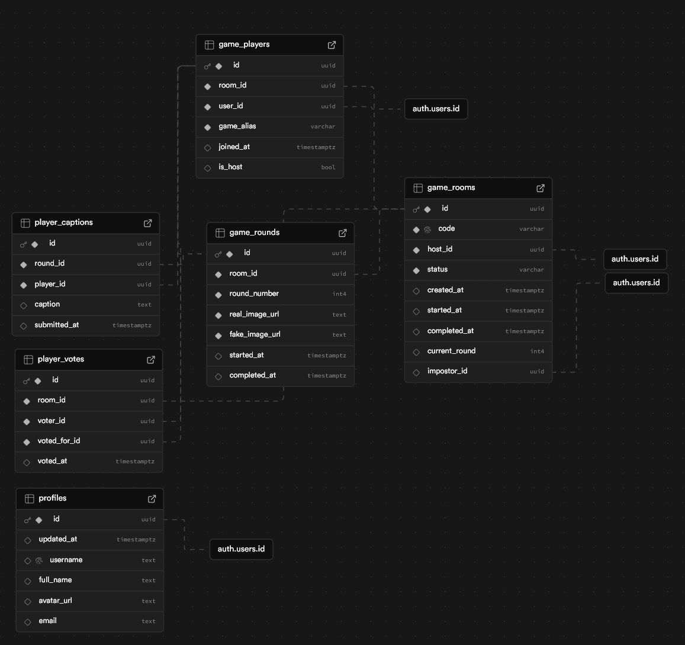

# Social Deduction Caption Game - Functional and Technological Specification

## Functional Specification

### Project Vision
This project is a real-time, interactive social deduction game designed specifically for desktop environments. Inspired by popular party games like Jackbox and social deduction titles such as Among Us, our game blends creativity and strategic interaction. Every player must sign in using Google, after which they are assigned a random in-game alias (completely independent from their Google profile). Over 6 rounds, players submit witty captions for image prompts—with one player (the impostor) unknowingly receiving a different image. At the end, all players participate in a final, unified vote to determine who the impostor is.

### Core Functions
- **User Authentication & Data Storage:**  
  All players authenticate via Google. Basic user data and game progress are securely stored in our backend.
- **Random In-Game Alias Assignment:**  
  Upon joining a game session, each authenticated user is assigned a randomly generated alias to maintain anonymity during gameplay.
- **Real-Time Interaction:**  
  The game leverages real-time updates to synchronize lobby status, caption submissions, and voting, ensuring a seamless and interactive experience.
- **Game Rounds & Unified Voting:**  
  The game features 6 rounds where players respond to image prompts with creative captions. After all rounds, a single final voting phase (in an Among Us–style) is conducted to identify the impostor—without any mid-game eliminations.
- **Desktop-First Experience:**  
  The user interface is specifically optimized for desktop use, focusing on rich interactions and a layout tailored to mouse and keyboard inputs.

## Technological Specification
hej
### Client Framework
- **Framework:** Next.js with React and TypeScript  
  - **Rationale:** Next.js offers a robust yet lightweight framework that supports both server-side rendering and dynamic client-side interactivity. This makes it ideal for building interactive, real-time applications.
  - **UI:** We are using Tailwind CSS (eg. with libraries such as Shadcn) to build a responsive, desktop-first layout that is both visually appealing and highly functional.
  - **State-management:** We will be using Zustand for our State-management solution. 

### Server Framework / Backend Setup
- **Backend as a Service:** Supabase  
  - **Components:** PostgreSQL database for data storage, real-time subscriptions for live updates, and built-in authentication services.
  - **Rationale:** Supabase provides an integrated backend solution that minimizes custom server development while offering robust support for interactivity, secure data storage, and user authentication.
- **Hosting:** Vercel  
  - **Rationale:** Vercel allows for seamless deployment of Next.js applications, ensuring scalability and a smooth development cycle with continuous integration.

  **Server Structure**
  
